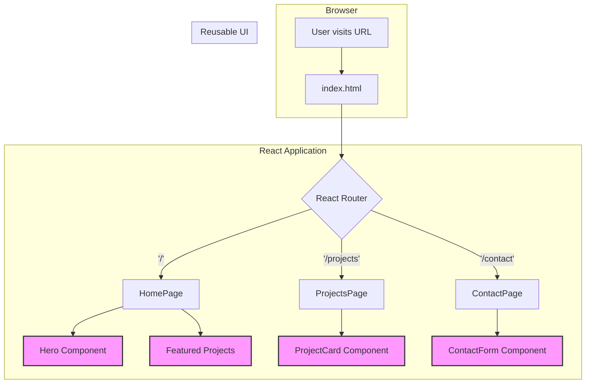

# My Portfolio

This is my personal portfolio website, showcasing my projects, skills, and professional background. It's built with modern web technologies and features a clean, responsive design.

## About Me

I'm a passionate developer with a love for creating beautiful and functional web applications. I specialize in [Your Specialization] and have experience with a variety of technologies. This portfolio is a reflection of my skills and my journey as a developer.

## Features

*   **Responsive Design:** Looks great on all devices, from mobile phones to desktops.
*   **Project Showcase:** A dedicated section to display my work with details and links.
*   **Blog:** A space to share my thoughts and experiences.
*   **Interactive Elements:** Engaging animations and interactive components to enhance the user experience.

## Tech Stack

This project is a pure frontend application built with the following technologies:

*   **Framework/Library:** React
*   **Build Tool:** Vite
*   **Language:** TypeScript
*   **Styling:** Tailwind CSS
*   **Animations:** Framer Motion
*   **Deployment:** Netlify

## Frontend Flow

This diagram illustrates the architecture of the React application.



## Getting Started

To run this project locally, follow these steps:

### Prerequisites

*   Node.js (v18 or higher)
*   npm

### Installation

1.  **Clone the repository:**
    ```sh
    git clone https://github.com/your-username/your-repo-name.git
    cd your-repo-name
    ```

2.  **Install dependencies:**
    ```sh
    npm install
    ```

### Running the Application

To start the development server, run the following command from the root directory:

```sh
npm run dev
```

This will start the Vite development server, typically on `http://localhost:5173`.

## Project Structure

The project is organized as a standard Vite-based React application.

```
.
├── public/           # Static assets
├── src/              # Frontend source code
│   ├── components/   # React components
│   ├── pages/        # Page components
│   └── App.tsx       # Main application component
├── package.json      # Project dependencies
└── vite.config.ts    # Vite configuration
```

## Deployment

This project can be easily deployed to Netlify.

1.  Push your code to a GitHub repository.
2.  Connect your GitHub account to Netlify.
3.  Select the repository.
4.  Use the following build settings:
    *   **Build command:** `npm run build`
    *   **Publish directory:** `dist`
5.  Deploy!
